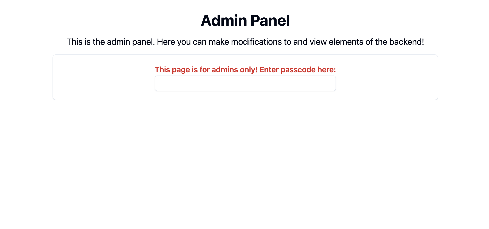
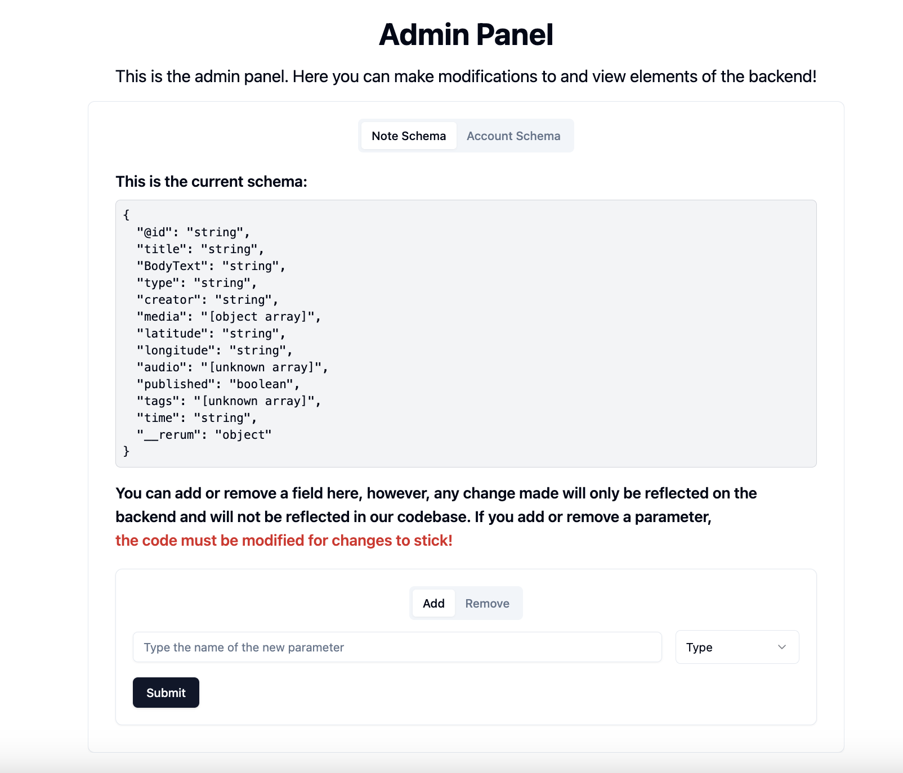
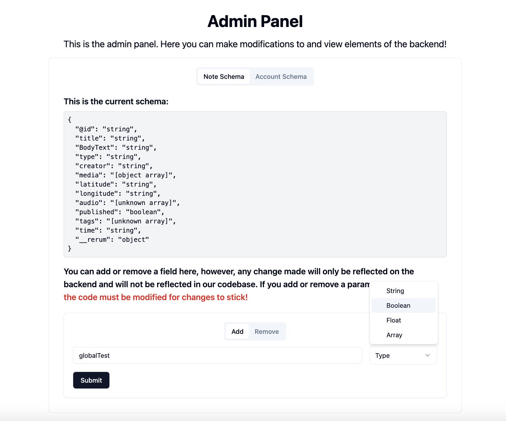
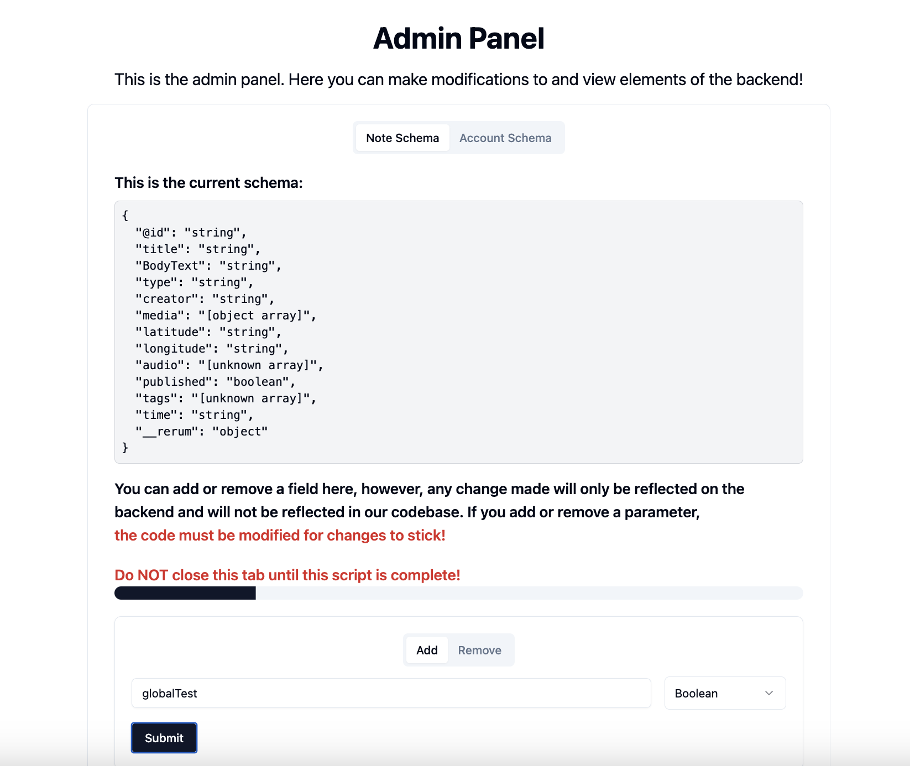
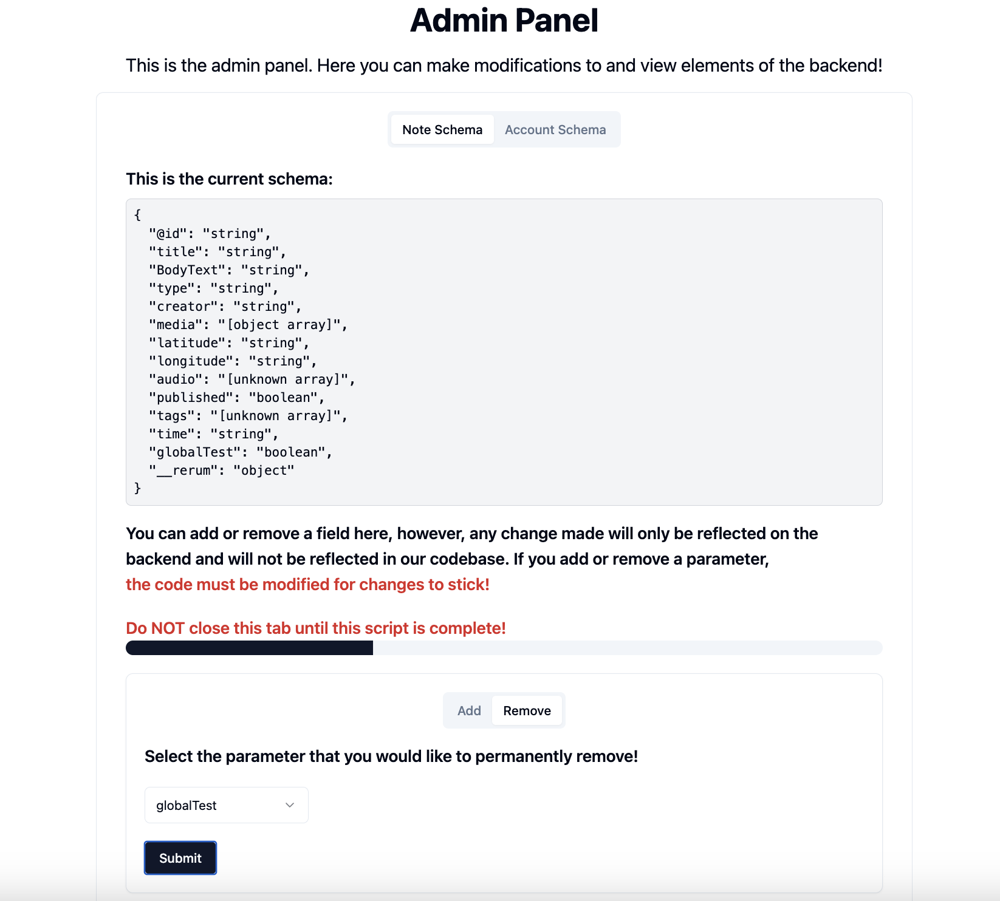
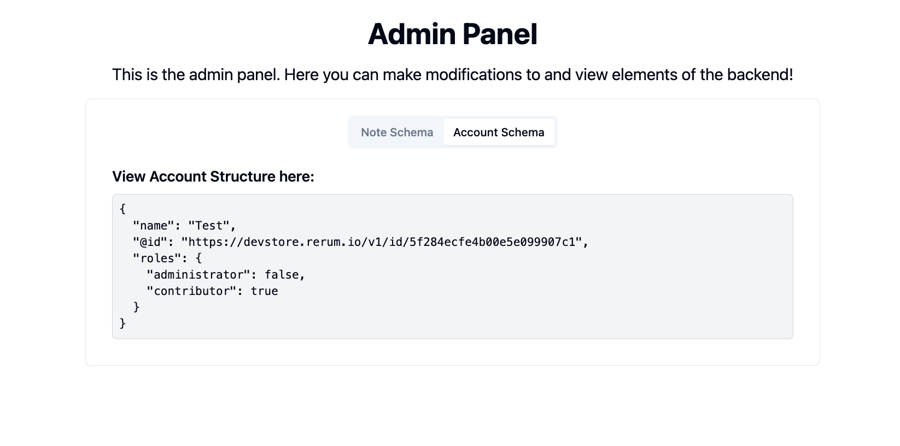

This is the documentation for the Admin Panle for the lived religion desktop.

The Admin panel was initially developed in order to make changes to the backend on using the frontend. Note any of the changes made here will be reflected on the production database and cannot be reverted.

## Know Before You Go

1. Please for the love of all things good do not change anything without approval from the admins on this project. As mentioned above. Changes made on this page will reflect on every single entry within the production database.
1. Because every change made on this page is reflected on the production database build out the supporting code on mobile and desktop **\*before** making changes to the entries

## The Main Functions

- This page has three main functions
  1. **Add parameter to every entry:** This will like mentioned above **permanently** _add_ the selected attribute from **every** entry in the production database.
  1. **Remove parameter from every entry:** This will like mentioned above **permanently** _remove_ the selected attribute from **every** entry in the production database.
  1. **View the schema of the user:** This was built out in order to view the different roles that may be on a given user in the future, but at this time there are no ways to actually make changes to the user class. This is simply for viewing, but is useful nonetheless.

## Access

Now that you have read everything above. You are ready to use this feature. The panel can be found by adding the following to the searchbar:
`/lib/pages/adminPanel`
Upon doing so you will be greeted with the following graphic.

If running off of localhost you can customize the password according to your liking by going into your `.env.local` and adding the following line
`NEXT_PUBLIC_ADMIN_PASKEY=passwordHere`
customizing passwordHere to your liking. The password used in the public build can be accessed through the project admin.

## Entry Schema Modification

Once you have configured your password and entered it in you will be greeted with the following screen:

Now that we are in let's get into the **first** main function!
Below you can see that I am choosing to add the variable `globalTest` with the type parameter set to `boolean`. You are welcome to run a similar test, just know that when making a change like this clientside instead of serverside many things could go wrong, so make changes at your own risk.

### Adding Field

Upon submitting your request you will be greeted by a loading bar. This bar indicates in realtime how many of the entries you have made modifications to (see below). If you close this page before this finishes executing the new parameter will only be added to some of the entries. In order remedy a mistake like this please rerun the command and wait for it to finish executing.

### Removing Field

After it has finished executing you will see that in the current schema you will find your new field. In my specific example, I did not wish to have `globalTest` as a new parameter, so I have selected it from the available options on the dropdown and once again began the execution for removing said parameter.

### Account Schema

The Account schema is the second tab available on the Admin Panel. There is not anything that you can do on that tab, but you can view what parameters are currently on a given user's schema. Below is what that screen looks like.

You can then put in the credentials of a user to see what they look like. In this example, I just input the test user credentials of:
- username: Test
- password: test

_If you are curious to see what your own credentials look like go ahead and login to this field and see how yours compare to the Test user's schema_

